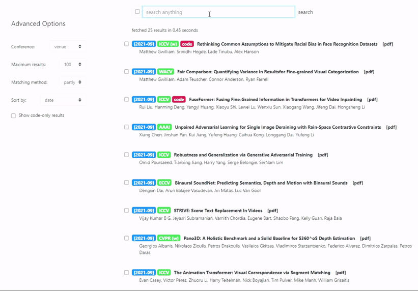

# ⚡ arxivbox [](https://shields.io/)



## 💬 Install & Usage

```bash
$ pip install arxivbox
$ python -m arxivbox
```
The app is built using Dash API. If installed successfully the output should look like follow:

```bash

Dash is running on http://127.0.0.1:27014/

 * Serving Flask app '__main__' (lazy loading)
 * Environment: production
   WARNING: This is a development server. Do not use it in a production deployment.
   Use a production WSGI server instead.
 * Debug mode: off
 * Running on http://127.0.0.1:27014/ (Press CTRL+C to quit)
 
```
## 💬 How to add other conferences & Journals?

Currently, arxivbox considers only major computer vision and machine learning conferences. There is an option to enter custom conference name. However, if someone wants to change the default list then it should be done by changing the `confs` variable in the __main__.py file.


